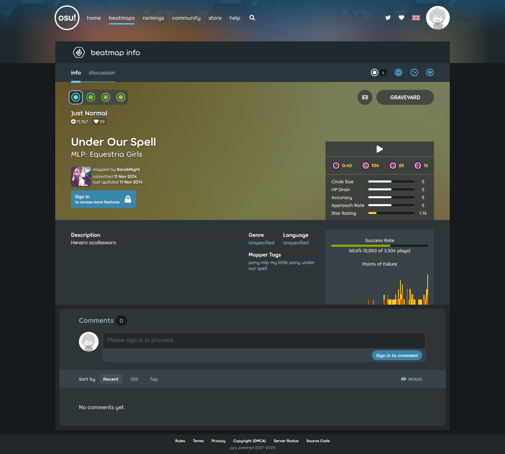

# Visited: https://osu.ppy.sh/beatmapsets/231791
**Time:** Sun May 10 18:37:30 UTC 2026

## Screenshot

## Raw HTML
[page.html](./page.html)

## Downloaded Media (4 files)
## Downloaded Media Files

## Other Links
- [#](#)
- [/assets/css/app.d7e90a80.css](/assets/css/app.d7e90a80.css)
- [/assets/js/app.f59c0f66.js](/assets/js/app.f59c0f66.js)
- [/assets/js/beatmapsets-show.2368bae4.js](/assets/js/beatmapsets-show.2368bae4.js)
- [/assets/js/commons.c4a4e910.js](/assets/js/commons.c4a4e910.js)
- [/assets/js/locales/en.4ba09cb7.js](/assets/js/locales/en.4ba09cb7.js)
- [/assets/js/moment-locales/en-gb.22ed6c6e.js](/assets/js/moment-locales/en-gb.22ed6c6e.js)
- [/assets/js/runtime.18c87bdd.js](/assets/js/runtime.18c87bdd.js)
- [/assets/js/vendor.75a92909.js](/assets/js/vendor.75a92909.js)
- [https://discord.gg/ppy](https://discord.gg/ppy)
- [https://github.com/ppy](https://github.com/ppy)
- [https://osu.ppy.sh](https://osu.ppy.sh)
- [https://osu.ppy.sh/beatmaps/artists](https://osu.ppy.sh/beatmaps/artists)
- [https://osu.ppy.sh/beatmaps/packs](https://osu.ppy.sh/beatmaps/packs)
- [https://osu.ppy.sh/beatmapsets](https://osu.ppy.sh/beatmapsets)
- [https://osu.ppy.sh/beatmapsets/231791](https://osu.ppy.sh/beatmapsets/231791)
- [https://osu.ppy.sh/community/chat](https://osu.ppy.sh/community/chat)
- [https://osu.ppy.sh/community/contests](https://osu.ppy.sh/community/contests)
- [https://osu.ppy.sh/community/forums](https://osu.ppy.sh/community/forums)
- [https://osu.ppy.sh/community/livestreams](https://osu.ppy.sh/community/livestreams)
- [https://osu.ppy.sh/community/tournaments](https://osu.ppy.sh/community/tournaments)
- [https://osu.ppy.sh/home/changelog](https://osu.ppy.sh/home/changelog)
- [https://osu.ppy.sh/home/download](https://osu.ppy.sh/home/download)
- [https://osu.ppy.sh/home/news](https://osu.ppy.sh/home/news)
- [https://osu.ppy.sh/home/password-reset](https://osu.ppy.sh/home/password-reset)
- [https://osu.ppy.sh/home/search](https://osu.ppy.sh/home/search)
- [https://osu.ppy.sh/home/set-locale?locale=ar](https://osu.ppy.sh/home/set-locale?locale=ar)
- [https://osu.ppy.sh/home/set-locale?locale=be](https://osu.ppy.sh/home/set-locale?locale=be)
- [https://osu.ppy.sh/home/set-locale?locale=bg](https://osu.ppy.sh/home/set-locale?locale=bg)
- [https://osu.ppy.sh/home/set-locale?locale=ca](https://osu.ppy.sh/home/set-locale?locale=ca)
- [https://osu.ppy.sh/home/set-locale?locale=cs](https://osu.ppy.sh/home/set-locale?locale=cs)
- [https://osu.ppy.sh/home/set-locale?locale=da](https://osu.ppy.sh/home/set-locale?locale=da)
- [https://osu.ppy.sh/home/set-locale?locale=de](https://osu.ppy.sh/home/set-locale?locale=de)
- [https://osu.ppy.sh/home/set-locale?locale=el](https://osu.ppy.sh/home/set-locale?locale=el)
- [https://osu.ppy.sh/home/set-locale?locale=en](https://osu.ppy.sh/home/set-locale?locale=en)
- [https://osu.ppy.sh/home/set-locale?locale=es](https://osu.ppy.sh/home/set-locale?locale=es)
- [https://osu.ppy.sh/home/set-locale?locale=fi](https://osu.ppy.sh/home/set-locale?locale=fi)
- [https://osu.ppy.sh/home/set-locale?locale=fil](https://osu.ppy.sh/home/set-locale?locale=fil)
- [https://osu.ppy.sh/home/set-locale?locale=fr](https://osu.ppy.sh/home/set-locale?locale=fr)
- [https://osu.ppy.sh/home/set-locale?locale=he](https://osu.ppy.sh/home/set-locale?locale=he)
- [https://osu.ppy.sh/home/set-locale?locale=hu](https://osu.ppy.sh/home/set-locale?locale=hu)
- [https://osu.ppy.sh/home/set-locale?locale=id](https://osu.ppy.sh/home/set-locale?locale=id)
- [https://osu.ppy.sh/home/set-locale?locale=it](https://osu.ppy.sh/home/set-locale?locale=it)
- [https://osu.ppy.sh/home/set-locale?locale=ja](https://osu.ppy.sh/home/set-locale?locale=ja)
- [https://osu.ppy.sh/home/set-locale?locale=ko](https://osu.ppy.sh/home/set-locale?locale=ko)
- [https://osu.ppy.sh/home/set-locale?locale=lt](https://osu.ppy.sh/home/set-locale?locale=lt)
- [https://osu.ppy.sh/home/set-locale?locale=nl](https://osu.ppy.sh/home/set-locale?locale=nl)
- [https://osu.ppy.sh/home/set-locale?locale=no](https://osu.ppy.sh/home/set-locale?locale=no)
- [https://osu.ppy.sh/home/set-locale?locale=pl](https://osu.ppy.sh/home/set-locale?locale=pl)
- [https://osu.ppy.sh/home/set-locale?locale=pt](https://osu.ppy.sh/home/set-locale?locale=pt)

## Stats
- Links: 92
- Media: 4
